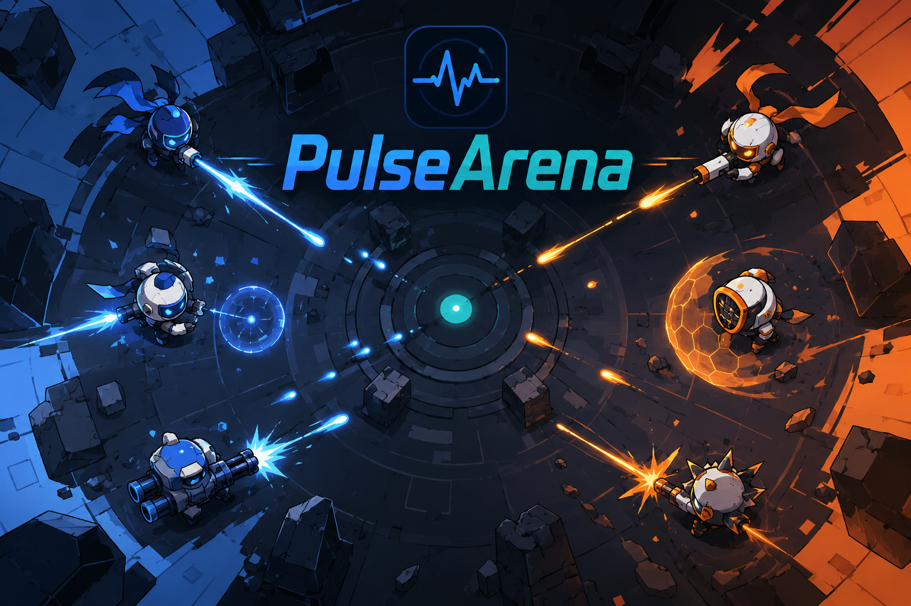

<div align="center">



# ⚡ Pulse Arena

**A Godot 4.x 2D top-down projectile arena + reinforcement-learning training skeleton.**

1–4 players · 4 themed arenas · Hybrid Tactical Agent · 5-tier difficulty · web playtest

<br/>

[](LICENSE)
[](https://godotengine.org/)
[](https://www.python.org/)
[](#-requirements)
[]()

</div>

---

## 📖 What is Pulse Arena?

> Pulse Arena is a lightweight arena prototype aimed at **both gameplay and AI training**: the same engine powers human-vs-agent matches and a hierarchical tactical agent's RL environment. The model only chooses high-level tactical intent — **all low-level movement, predictive aim, fire gating, dodge, and safety fallback are handled by deterministic algorithms in Godot**, so the AI can't "cheat" by learning exploit-shaped actions.

| 🎯 **Pillar** | What it delivers |
|---|---|
| 🕹️ **Playable** | Full menu, HUD, pause, results, mixed human/agent matches, 5-tier difficulty |
| 🧠 **Trainable** | Unified `AgentObservation` / `PlayerAction` / `EnvironmentBridge` interfaces |
| 🔬 **Auditable** | Hybrid Tactical v2 protocol · mask-aware categorical heads · strict safety-override bookkeeping |
| 🌐 **Distributable** | WebAssembly playtest + WebSocket ↔ TCP inference bridge |

---

## ✨ Highlights

- 🤖 **Hybrid Tactical Agent** — high-level `target_slot · movement_mode · fire_mode · skill_mode` four masked categorical heads (Protocol v2); low level fully deterministic
- 🗺️ **4 themed arenas** — Dungeon Keep · Sky City · Jungle Ruins · Mist World (each with its own `MapRuleBase`)
- 🎮 **4 match modes** — 1v1 · 1v2 · 1v3 · 2v2 (with friendly-fire toggle for 2v2)
- 🎚️ **5-tier difficulty** — one checkpoint, five strengths (`easy / casual / normal / strong / elite`) via `temperature + mask_soften + safety_threshold`
- 🧪 **Full test chain** — Godot unit tests + static project check + headless match smoke + end-to-end WebSocket playtest
- 🌐 **Web playtest** — browser → WebSocket bridge → inference service → `.pt` checkpoint
- 📊 **Training pipeline** — Protocol v2 BC warm-start → masked tactical PPO/MAPPO → 8-GPU multi-task pilot → candidate gate
- 🔒 **Privacy & safety** — mist / hidden enemy private state never enters actor features; no raw-action training path; `raw_step_calls > 0` voids the run

---

## 🚀 Quick Start

### 📋 Requirements

- 🐧 Ubuntu 24.04 x86_64 (or any modern Linux with glibc 2.35+)
- 🎮 Godot 4.7 with Linux export templates (Web export templates for in-browser debugging)
- 🐍 Python 3.10+ (training additionally requires PyTorch / NumPy / Matplotlib)

### ⬇️ Install

```bash
make setup                       # creates a venv and installs deps
export GODOT_BIN=/path/to/godot  # only needed if godot isn't on PATH
```

### ▶️ Launch the game

```bash
godot --path .
```

Pick a map, mode, player count and difficulty on the main menu, then start.

### ⌨️ Controls (Player 1)

| Key | Action |
|---|---|
| <kbd>W</kbd> <kbd>A</kbd> <kbd>S</kbd> <kbd>D</kbd> | Move |
| 🖱️ Mouse | Aim |
| 🖱️ Left-click | Shoot |
| <kbd>Space</kbd> | Dash |
| 🖱️ Right-click | Shield |
| <kbd>Esc</kbd> | Pause / Resume |
| <kbd>Backspace</kbd> | Return to menu |

Player 2: `Arrow keys` move · `IJKL` aim · `RCtrl` shoot · `RShift` dash · `Enter` shield.

---

## 🎮 Modes & Arenas

| Mode | Notes |
|---|---|
| **1 Human vs 1 Agent** | Classic 1v1 |
| **1 Human vs 2 Agents** | Outnumbered 1v2 |
| **1 Human vs 3 Agents** | Outnumbered 1v3 |
| **2 Humans vs 2 Agents** | 2v2 team, **friendly fire off** |

| Arena | Signature mechanic |
|---|---|
| 🏰 **Dungeon Keep** | Cage traps, stone walls, line-of-sight pressure |
| 🌆 **Sky City** | Moving barriers, void crush zones, high-altitude ballistics |
| 🌿 **Jungle Ruins** | Swamp slowdown, neutral snakes, camouflage fog-of-war |
| 🌫️ **Mist World** | Visibility fog, memory-based reasoning, wormhole portals |

> Each map owns a `scripts/arena/map_rules/<id>_rule.gd` so mechanic updates never touch core combat.

---

## 🧠 Agent Architecture (one-liner)

```text
AgentObservation (visible state, 142-dim tactical features + 4 action masks)
  → TacticalPolicyNet (high-level actor-critic)
  → HighLevelDecision (target · movement · fire · skill)
  → HybridCombatExecutor (deterministic safe execution)
  → PlayerAction
  → ArenaPlayer
```

- **The actor reads only public visible state**; hidden enemy private state never enters features.
- **Every shot** is gated by LOS / wall / friendly-fire / cooldown / energy-reserve / hit-probability bookkeeping.
- **Failure fallback** — service disconnect, timeout, NaN, or low-confidence decisions auto-switch to Scripted Hard.

📚 See [`docs/architecture/hybrid-agent.md`](docs/architecture/hybrid-agent.md) and [`docs/agents/interface.md`](docs/agents/interface.md).

---

## ⚙️ Headless / Training

### Headless match smoke

```bash
godot --headless --path . -- --training --matches=1 --agents=4 --seed=1234 --seconds=10 --map=dungeon
```

### Training pipeline entry points

```bash
# Local validation
python training/pipeline/train_pipeline.py --profile local_constrained --phase validate
python training/pipeline/train_pipeline.py --profile local_constrained --phase collect
python training/pipeline/train_pipeline.py --profile local_constrained --phase bc

# 8-GPU multi-task server pilot
python training/pipeline/train_pipeline.py --profile full_distributed_league --plan hybrid_tactical_v2_8gpu_parallel_pilot --phase ppo-multi
```

📚 Full continuation-training roadmap: [`docs/plan/README.md`](docs/plan/README.md).

---

## 🌐 Web Playtest

Push the 5-tier models into the browser and play over SSH:

```bash
make web-export                  # builds Godot → build/web/

# 1) Inference service
.venv/bin/python -m training.inference.serve_agent \
    --catalog training/models/model_catalog.json \
    --host 0.0.0.0 --port 8766 --device auto

# 2) WebSocket bridge + static file server (loopback only)
python3 scripts/linux/web_preview_server.py \
    --directory "$(pwd)/build/web" \
    --host 127.0.0.1 --port 8080 \
    --agent-host 127.0.0.1 --agent-port 8766
```

Then open `http://127.0.0.1:8080/` in a browser. For remote SSH hosts, tunnel with `ssh -L 8080:127.0.0.1:8080`.

📚 See [`docs/deployment/web-playtest-deployment.md`](docs/deployment/web-playtest-deployment.md).

---

## 🧪 Tests

| Level | Command |
|---|---|
| Static check (no Godot needed) | `python tests/smoke/static_project_check.py` |
| Godot unit tests | `godot --headless --path . --script tests/run_tests.gd` |
| Full Linux smoke | `make test` |
| Web end-to-end smoke | `python tests/smoke/web_candidate_playtest_check.py` |
| Linux release build | `make export-linux` |

---

## 📚 Documentation

| Entry | Contents |
|---|---|
| [`docs/README.md`](docs/README.md) | Top-level documentation index |
| [`docs/architecture/`](docs/architecture/) | Architecture & Hybrid Tactical Agent design |
| [`docs/agents/`](docs/agents/) | Agent interfaces & model integration |
| [`docs/game/`](docs/game/) | Gameplay, arenas, skills |
| [`docs/training/`](docs/training/) | Training strategy, workflow, runbooks |
| [`docs/plan/`](docs/plan/) | Continuation-training plan (authoritative entry) |
| [`docs/operations/`](docs/operations/) | Linux workflow & server training bundle |
| [`docs/paper/`](docs/paper/) | LaTeX paper (main.tex / main.pdf) |

---

## 📦 Repository Layout

```
PulseArena/
├── assets/         # art / audio / shaders
├── scenes/         # Godot scenes (menu, HUD, arena)
├── scripts/        # GDScript runtime (app / core / arena / rl / ...)
├── resources/      # balance tables / map data / themes
├── training/       # Python training stack (pipeline / rl / inference / ...)
├── tests/          # Godot and Python tests
├── docs/           # project documentation (Chinese)
├── figs/           # README promo art
├── project.godot   # Godot project config
└── Makefile        # top-level shortcuts
```

---

## 🤝 Contributing

Issues and PRs are welcome. Before opening one, please:

1. Skim [`docs/architecture/overview.md`](docs/architecture/overview.md) and [`docs/operations/project-structure.md`](docs/operations/project-structure.md).
2. Run `make check` after touching static assets / script paths / key fields.
3. Run `make test` after touching maps / players / HUD.
4. Read [`docs/agents/interface.md`](docs/agents/interface.md) before changing AI interfaces.

---

## 📄 License

This project is released under the [Apache License 2.0](LICENSE).
